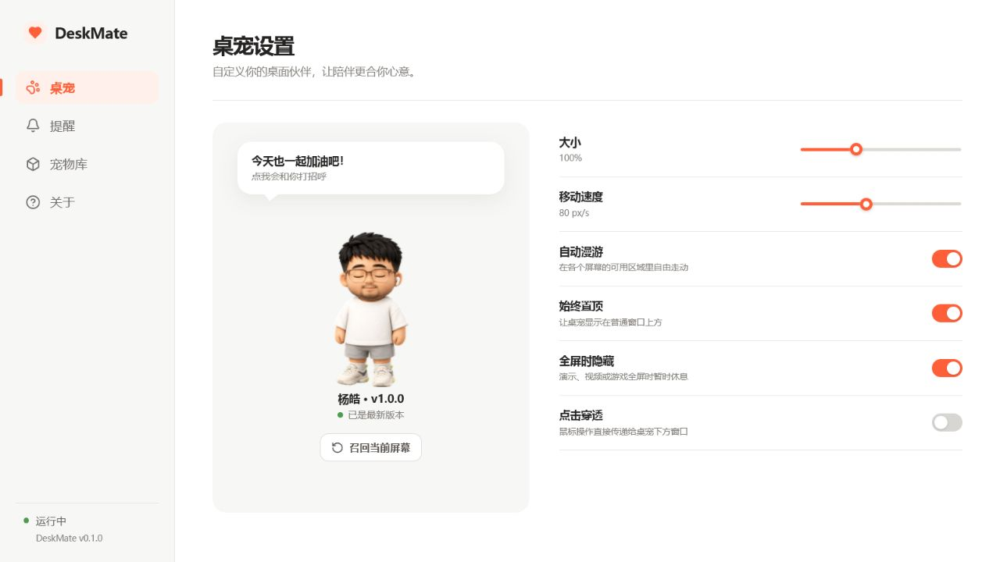

# DeskMate

DeskMate 是一个开源的 Windows 桌宠：默认伙伴会在多显示器桌面上漫游、看向鼠标、回应点击，并用安静的小气泡提醒你喝水、远眺和活动。



## 功能

- Tauri 2 + React/TypeScript，三个独立窗口：桌宠、提醒气泡、设置。
- 透明置顶、拖动、单击跳跃、双击挥手、右键随机动作、16 向注视、跨屏漫游和任务栏避让。
- 开机启动、单实例、系统托盘、全局召回/点击穿透快捷键。
- 本地间隔或固定时间提醒；睡眠、拖动和全屏期间不会补发历史提醒。
- 官方 GitHub Pages 宠物目录；宠物包验证 HTTPS、SHA-256、大小、ZIP 路径、白名单、清单和 WebP v2 图集。
- 本机自定义宠物文件夹；无需打包或上传，重新扫描后即可选择使用。
- GitHub Releases 程序更新；更新产物使用 Tauri 密钥签名。
- 无账号、无云同步、无遥测、无声音。

## 系统要求

- Windows 10/11 x64
- 系统 WebView2 Runtime（Windows 10/11 通常已安装；安装包不内置 127 MB 离线运行时）

首批公开构建暂不使用商业 Windows 代码签名，SmartScreen 可能显示提示；Tauri 应用更新产物仍必须使用项目私钥签名。

## 本地开发

日常修改界面和业务逻辑只需要 Node.js 22+ 与 pnpm 11，不必安装 Visual Studio Build Tools：

```powershell
pnpm install --frozen-lockfile
pnpm verify
pnpm dev
```

浏览器可使用 `?view=settings`、`?view=pet`、`?view=bubble` 或 `?view=onboarding` 查看各窗口。

需要调试原生窗口时，才需要额外安装 Rust stable 和 Tauri 的 Windows C++ 构建依赖，然后运行：

```powershell
pnpm tauri dev
```

## 云端 Windows 构建

本机无需安装约 6–7 GB 的 Windows 编译工具。推送 `main`、`feature/**` 分支或打开 PR 会在 GitHub Actions 的 `windows-latest` runner 上运行完整前端检查、Rust 测试并生成 x64 NSIS 安装包。

也可以在仓库的 **Actions → Windows preview → Run workflow** 手动选择分支构建。完成后在该次运行的 **Artifacts** 区域下载 `DeskMate-Windows-x64`；测试安装包保留 14 天，并且暂未进行商业 Windows 代码签名。

## 快捷键

- `Ctrl + Alt + M`：召回桌宠
- `Ctrl + Alt + P`：切换整窗点击穿透

## 导入自己的宠物

打开 **设置 → 宠物库 → 打开自定义宠物文件夹**。DeskMate 会使用应用数据目录下的 `custom-pets`，避免 Windows 安装目录的写入权限问题，也不会在升级应用时被覆盖。每只宠物单独放在一个子文件夹：

可以先在 [Codex Pet Gallery](https://codex-pet.org/zh/) 浏览和下载社区宠物。DeskMate 会在导入时自动识别 Codex v1 的 8×9 图集和 Codex v2 的 8×11 图集。

```text
custom-pets/
└─ studio-cat/
   ├─ pet.json
   └─ spritesheet.webp
```

`pet.json` 示例：

```json
{
  "id": "studio-cat",
  "displayName": "工作室小猫",
  "description": "陪大家安静工作的伙伴",
  "spriteVersionNumber": 2,
  "spritesheetPath": "spritesheet.webp"
}
```

点击“重新扫描”后即可在宠物库选择。`id` 只能使用小写英文字母、数字和短横线；图集必须是带透明通道的 Codex WebP：v1 为 1536×1872（8×9），v2 为 1536×2288（8×11）。旧版 v1 清单可以不写 `spriteVersionNumber`，DeskMate 会按尺寸识别；由于 v1 没有 16 向注视帧，运行时会自动回退到 idle 动画。无效文件夹会单独显示错误，不影响其他宠物。

## 发布

推送 `vX.Y.Z` 标签会触发 Windows x64 NSIS 构建、Tauri 更新签名、GitHub Release、`latest.json` 以及 GitHub Pages 宠物目录发布。仓库需要配置：

- `TAURI_SIGNING_PRIVATE_KEY`（Actions Secret）
- `TAURI_SIGNING_PRIVATE_KEY_PASSWORD`（Actions Secret）
- `TAURI_SIGNING_PUBLIC_KEY`（Actions Secret；它不是机密，但以同一入口管理）

首次启用 Pages 时，将 Source 设为 **GitHub Actions**。

试用版发布前按 [发布验收清单](docs/release-checklist.md) 在至少三台不同 DPI/多屏电脑上连续验证三个工作日。

## 许可证

程序代码采用 [MIT](LICENSE)。默认伙伴素材不适用 MIT，见 [独立素材许可](assets/pets/yanghao/ASSET_LICENSE.txt)。
